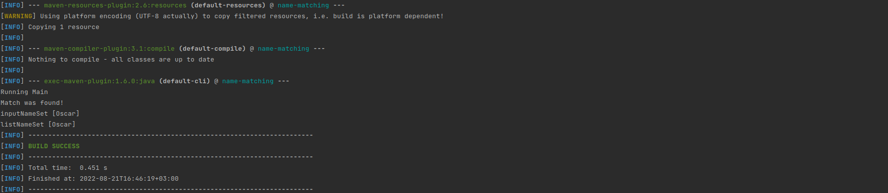

# Blacklist Name Matching

## Technologies used
* Apache Maven 3.6.3
* openjdk version "1.8.0_312"
* junit 4.13.1
* org.apache.commons 1.9

## Setting up the program
Open the file found at `src/main/resources/config.properties` and set the following arguments for the program:
* namesFileLocation - *location of the blacklisted names file*
* noiseWordsFileLocation - *location of the noise words file*
* acceptTypos - *should the program account for typos or not*

## Running the program
From terminal run `mvn compile exec:java -Dexec.args="'Oscar'"`

where `-Dexec.args` value is the input name to validate against  
NB! Single quotes are important

### Output

## Running unit tests
From terminal run `mvn test`
